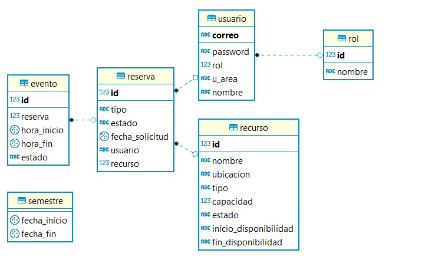
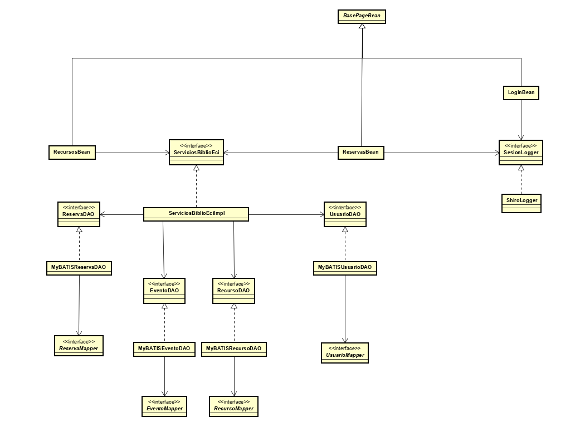
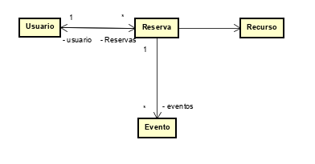
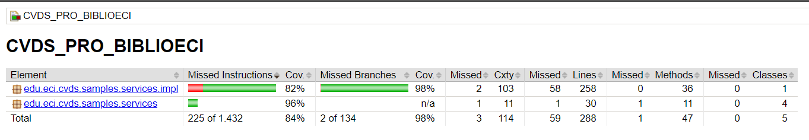
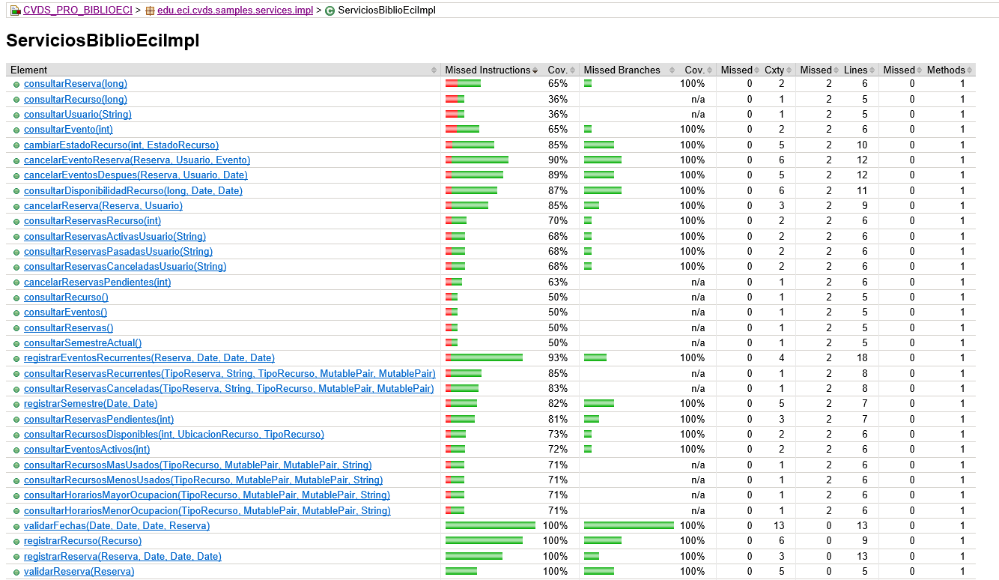
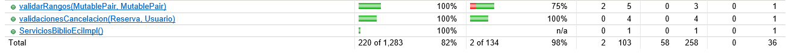
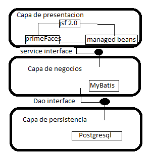

# Biblioeci

Aplicación web para la gestión y reserva de recursos de la biblioteca de la Escuela Colombiana de Ingeniería Julio Garavito.

**Curso:** Ciclos de Vida del Desarrollo de Software

## Integrantes y Roles

|     Nombre    |     Rol         |
|:--------------:|:-------------: |
|Santiago Alzate|Product Owner    |
|Juan Angel |Team Developer       |
|Juan Rojas |Team Developer       |
|Daniel Walteros |Team Developer  |
|David Vasquez |Team Developer    |

## Estado del Proyecto

## Descripción del Producto

#### Descripción General
Biblioeci es una herramienta donde el personal de la biblioteca pertenecientes a la Escuela Colombiana de Ingeniería Julio Garavito, pueden registrar las salas de estudio, equipos de cómputo y demás recursos con los que cuenta la biblioteca, junto con los horarios de disponibilidad y demás información importante.

#### Manual de Usuario

Para poder utilizar los servicios que ofrece Biblioeci es necesario iniciar sesión.

Las credenciales para ingresar son las siguientes:

+ **Usuario:** *adm@adm.com*
+ **Contraseña:** *213*

Ver [funcionalidades](resources/md/manual.md)

## Arquitectura y Diseño

#### Modelo E-R

#### Diagrama de Clases

#### Cobertura de pruebas

### Descripción de la arquitectura (Capas)

#### Stack de Tecnología Utilizado

   * [PrimeFaces (Framework)](https://www.primefaces.org/)
   * [JUnit (Property Based Testing)](https://junit.org/junit5/)
   * [Guice (Inyección de Dependencias)](https://github.com/google/guice)
   * [PostgreSQL (DataBase Management)](https://www.postgresql.org)
   * [Jacoco (cobertura de pruebas)](https://www.jacoco.org/)

#### Enlaces

+ [Despliegue en Heroku](https://biblioeci-cvds2019.herokuapp.com/)
+ [Integración Continua (CircleCI)](https://circleci.com/gh/CVDSTEAM-ERROR-404)

## Descripción del Proceso
#### Integrantes

|     Nombre    |     Rol         |
|:--------------:|:-------------: |
|Juan Angel |Team Developer       |
|Juan Rojas |Team Developer       |
|Daniel Walteros |Team Developer  |
|David Vasquez |Team Developer    |

#### Metodología
Se utilizó la metodoloía Scrum en la cual el equipo se reune y planea lo que se realizará en el Sprint, se discute lo que es necesario para realizar la historia de usuario y se reparten las tareas entre los integrantes.
 
 Al finalizar cada Sprint, el equipo se reune para planear el siguiente y se comentan lo que sucedió con el anterior.
 
 #### Taiga
 
 [Taiga backlog](https://tree.taiga.io/project/jcro15-gestion-de-recursos-biblioteca/backlog)
 #### Información sprints
 
 Ver [Sprints](resources/md/Sprints.md)
